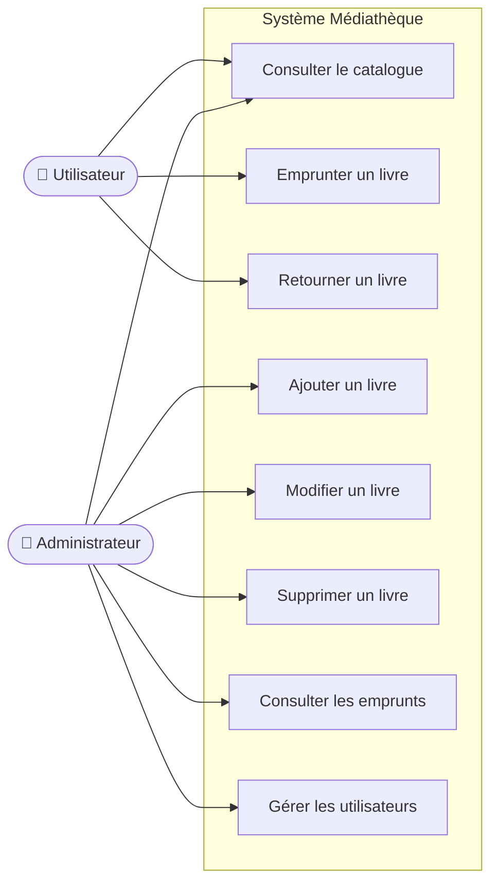
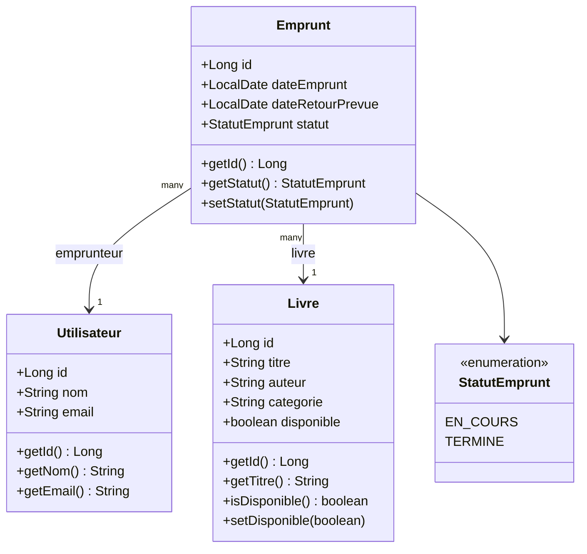
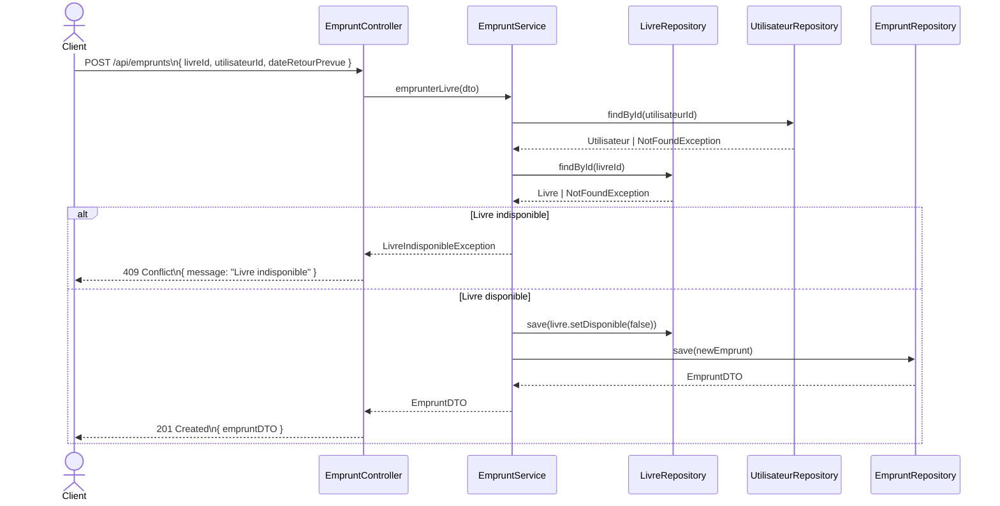
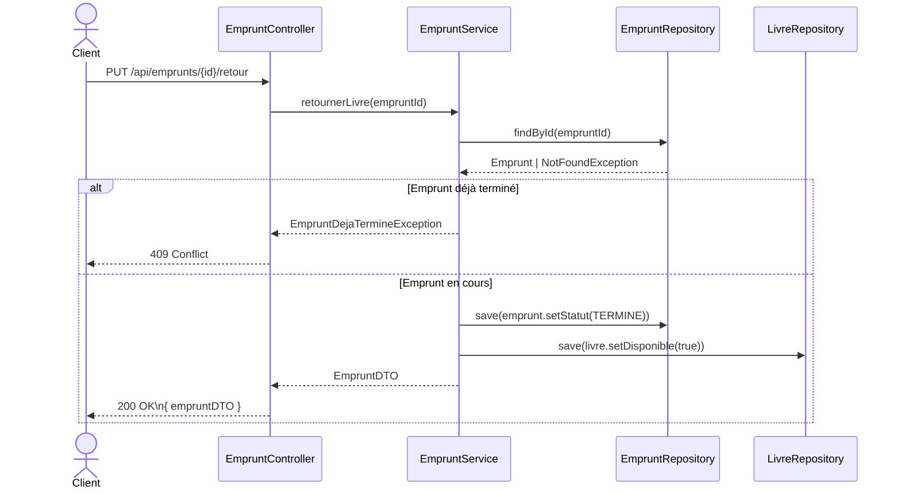

# Analyse – API REST de gestion d'une médiathèque numérique

---

## 1. Description du système

La médiathèque souhaite moderniser sa gestion manuelle des livres et des emprunts, source de plusieurs problèmes opérationnels :

| Problème identifié | Impact |
|---|---|
| Difficultés de suivi des emprunts | Impossibilité de savoir quels livres sont sortis et par qui |
| Pertes de livres non retournés | Aucune alerte sur les dépassements de date de retour |
| Absence de visibilité sur la disponibilité | Impossible de savoir rapidement si un ouvrage est disponible |
| Manque de traçabilité des utilisateurs | Les emprunteurs ne sont pas reliés de façon fiable aux emprunts |

Le système à développer est une **API REST Spring Boot** exposant des endpoints JSON pour la gestion du catalogue de livres, des utilisateurs et des emprunts. Elle sera consommée par une application web ou mobile (hors périmètre de ce projet).

---

## 2. Acteurs du système

### 2.1 Utilisateur
- Personne enregistrée dans le système.
- Peut **consulter** le catalogue de livres.
- Peut **emprunter** et **retourner** des livres.
- Peut être lié à plusieurs emprunts simultanément.

### 2.2 Administrateur
- Responsable de la gestion du catalogue.
- Peut **ajouter**, **modifier** et **supprimer** des livres.
- Peut **consulter** et **gérer** tous les emprunts et tous les utilisateurs.

---

## 3. Besoins fonctionnels

### 3.1 Gestion des livres

| Action | Description |
|---|---|
| Ajouter un livre | Créer une nouvelle entrée dans le catalogue |
| Modifier un livre | Mettre à jour les informations d'un livre existant |
| Supprimer un livre | Retirer un livre du catalogue (s'il n'a pas d'emprunt en cours) |
| Consulter la liste | Lister tous les livres disponibles |
| Consulter le détail | Afficher les informations complètes d'un livre |

**Attributs d'un Livre :**
- `id` – identifiant unique
- `titre` – titre de l'ouvrage
- `auteur` – nom de l'auteur
- `categorie` – genre / catégorie de l'ouvrage
- `disponible` – statut de disponibilité (`true` / `false`)

---

### 3.2 Gestion des utilisateurs

| Action | Description |
|---|---|
| Ajouter un utilisateur | Inscrire un nouvel utilisateur dans le système |
| Modifier un utilisateur | Mettre à jour les informations d'un utilisateur |
| Supprimer un utilisateur | Retirer un utilisateur du système |
| Consulter les utilisateurs | Lister tous les utilisateurs enregistrés |

**Attributs d'un Utilisateur :**
- `id` – identifiant unique
- `nom` – nom complet de l'utilisateur
- `email` – adresse email (unique)

---

### 3.3 Gestion des emprunts

| Action | Description |
|---|---|
| Emprunter un livre | Créer un emprunt liant un utilisateur à un livre disponible |
| Retourner un livre | Clôturer l'emprunt et rendre le livre disponible |
| Consulter les emprunts en cours | Lister tous les emprunts avec statut `EN_COURS` |

**Attributs d'un Emprunt :**
- `id` – identifiant unique
- `utilisateur` – référence à l'utilisateur emprunteur
- `livre` – référence au livre emprunté
- `dateEmprunt` – date de création de l'emprunt
- `dateRetourPrevue` – date limite de retour
- `statut` – `EN_COURS` ou `TERMINE`

---

## 4. Règles de gestion

| # | Règle |
|---|---|
| RG-01 | Un livre ne peut être emprunté que s'il est **disponible** |
| RG-02 | Un livre ne peut être emprunté que par **un seul utilisateur à la fois** |
| RG-03 | Un utilisateur peut emprunter **plusieurs livres simultanément** |
| RG-04 | Un emprunt retourné rend **automatiquement** le livre disponible |
| RG-05 | Un emprunt ne peut pas être créé pour un utilisateur ou un livre **inexistant** |
| RG-06 | Un livre **ne peut pas être supprimé** s'il a des emprunts en cours |

---

## 5. Diagrammes UML

### 5.1 Diagramme de cas d'utilisation



---

### 5.2 Diagramme de classes



---

### 5.3 Diagramme de séquence – Emprunter un livre



---

### 5.4 Diagramme de séquence – Retourner un livre



---

## 6. Architecture technique

L'application suit une **architecture en couches** :

```
controller      ← Points d'entrée REST (HTTP)
service         ← Interfaces des services métier
service.impl    ← Implémentations des services
repository      ← Accès base de données (JPA)
entity          ← Entités JPA (Livre, Utilisateur, Emprunt)
dto             ← Objets de transfert de données
exception       ← Exceptions métier personnalisées
config          ← Configuration Spring (Security, Swagger…)
```

**Stack technique :**
- Java 17
- Spring Boot 3.4.2
- Spring Data JPA
- Spring Security + JWT
- MySQL
- Lombok
- JUnit 5 + Mockito (tests)
- Swagger / OpenAPI (documentation)
